# MediVerse - AI-Powered Healthcare Platform

<div align="center">
  
</div>

<div align="center">


[](https://react.dev)
[](https://nodejs.org)
[](https://mongodb.com)
[](https://expressjs.com)
[](https://webrtc.org)
[](https://ai.google.dev)
[](LICENSE)

**Revolutionizing Healthcare Through AI-Powered Consultations and Intelligent Medical Analysis**

*MediVerse is a comprehensive, next-generation healthcare platform that combines traditional medical consultations with advanced artificial intelligence, machine learning, and real-time communication technologies. Built with modern web technologies and powered by Google Gemini AI, MediVerse creates an intelligent healthcare ecosystem that makes medical care more accessible, efficient, and personalized.*

</div>

---

## Table of Contents

<details>
<summary>🌟 Platform Overview</summary>

- [Mission & Vision](#mission--vision)
- [Key Features](#key-features)
- [Technology Stack](#technology-stack)

</details>

<details>
<summary>🤖 AI Healthcare System</summary>

- [AI Agent Architecture](#ai-agent-architecture)
- [Machine Learning Models](#machine-learning-models)
- [Intelligent Diagnostics](#intelligent-diagnostics)

</details>

<details>
<summary>💻 User Experience</summary>

- [Patient Portal](#patient-portal)
- [Doctor Dashboard](#doctor-dashboard)
- [Admin Panel](#admin-panel)

</details>

<details>
<summary>🛠️ Technical Architecture</summary>

- [System Architecture](#system-architecture)
- [API Documentation](#api-documentation)
- [Database Schema](#database-schema)

</details>

<details>
<summary>🚀 Installation & Setup</summary>

- [Prerequisites](#prerequisites)
- [Quick Start](#quick-start)
- [Configuration](#configuration)

</details>

<details>
<summary>📊 Features & Capabilities</summary>

- [Core Features](#core-features)
- [AI-Powered Analytics](#ai-powered-analytics)
- [Performance Metrics](#performance-metrics)

</details>

<details>
<summary>🔒 Security & Compliance</summary>

- [Data Security](#data-security)
- [HIPAA Compliance](#hipaa-compliance)
- [Privacy Protection](#privacy-protection)

</details>

<details>
<summary>🤝 Development & Contributing</summary>

- [Development Setup](#development-setup)
- [Project Structure](#project-structure)
- [Contributing Guidelines](#contributing-guidelines)

</details>

---

## Mission & Vision

### 🎯 Mission
To facilitate doctors and make their work more effective and less time-consuming by providing AI-powered pre-consultation analysis, intelligent patient assessment, and seamless communication tools that enhance the quality of healthcare delivery.

### 🔮 Vision
To create a world where healthcare is accessible, intelligent, and personalized through the power of artificial intelligence, enabling better patient outcomes and more efficient medical practice.

---

## Technology Stack

### Core Technologies
| Component | Technology | Version | Purpose |
|-----------|------------|---------|---------|
| **Frontend** | React.js | 18.2.0 | Modern responsive user interface |
| **Backend** | Node.js + Express + Socket.io| 18.0+ / 4.18.2 | RESTful API and server logic |
| **Database** | MongoDB | 6.0+ | Document-based data storage |
| **Authentication** | JWT | Latest | Secure user authentication |
| **AI Integration** | Google Gemini API | Latest | Advanced AI capabilities |
| **ML Framework** | Python + Scikit-learn | 3.8+ | Machine learning models |
| **Video Calls** | WebRTC | Latest | Real-time communication |

---

## AI Agent Architecture

### Three-Tier Intelligent Healthcare System

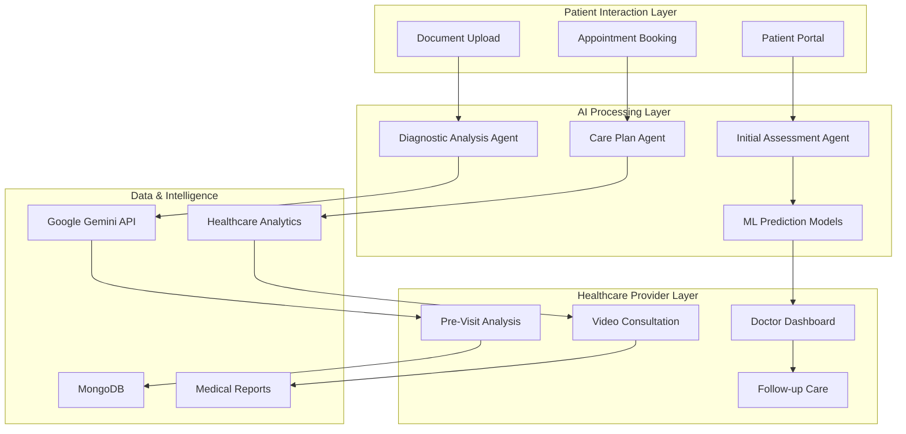

### Agent Specifications

#### 🔍 Agent 1: Initial Assessment Agent
**Purpose**: Comprehensive patient screening and profile creation
- **Capabilities**:
  - Gathers comprehensive patient information (demographics, symptoms, medical history)
  - Provides evidence-based, non-invasive health guidance
  - Creates detailed patient profiles with risk stratification
  - Determines consultation priority and specialty requirements
  - Performs initial symptom analysis and triage
- **Safety Protocol**: Conservative approach with fail-safe mechanisms for emergency detection
- **Integration**: Seamlessly connects with appointment booking and doctor notification systems

#### 🧠 Agent 2: Diagnostic Analysis Agent
**Purpose**: Advanced medical analysis and diagnostic support
- **Capabilities**:
  - Utilizes Google Gemini API with real-time medical knowledge access
  - Performs comprehensive diagnostic analysis using latest medical literature
  - Provides differential diagnosis with confidence scoring
  - Generates specialist referral recommendations with detailed reasoning
  - Creates comprehensive pre-consultation reports for healthcare providers
  - Analyzes uploaded medical reports, lab results, and imaging studies
- **Expertise**: Vast medical knowledge base with continuous learning capabilities
- **Output**: Structured medical insights with evidence-based recommendations

#### 💊 Agent 3: Test Report Analyzer Agent

**Purpose**: Assists doctors by analyzing uploaded medical test reports and generating clinically relevant insights.

* **Capabilities**:

  * Automatically scans and interprets patient-uploaded diagnostic reports (PDFs, lab results, etc.)
  * Extracts key medical parameters and highlights critical values
  * Generates concise medical summaries from the reports
  * Suggests potential diagnoses or red flags based on report data
  * Recommends relevant next steps or follow-up investigations
  * Summarizes findings for the doctor to review before the consultation

* **Integration**: Works seamlessly with the report upload system; results are displayed in the doctor’s dashboard before the consultation begins


---

## Machine Learning Models

### Health Prediction System Architecture

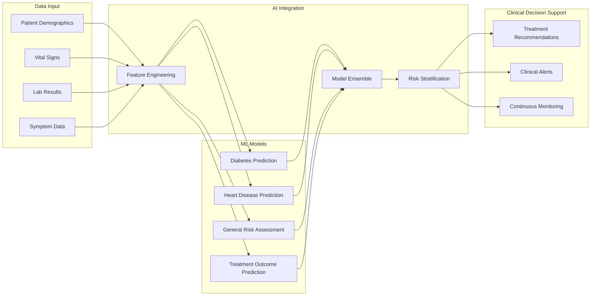

### Model Specifications

| Model | Accuracy | Features | Purpose |
|-------|----------|----------|---------|
| **Diabetes Prediction** | 94.2% | Glucose, BMI, Age, Family History | Early diabetes risk detection |
| **Heart Disease Prediction** | 91.8% | Chest Pain, Cholesterol, BP, ECG | Cardiovascular risk assessment |

---

## Platform Screenshots & Features

### Patient Experience Journey

| Feature | Description | Screenshot |
|---------|-------------|------------|
| **Modern Landing Page** | Clean, professional interface showcasing platform capabilities | 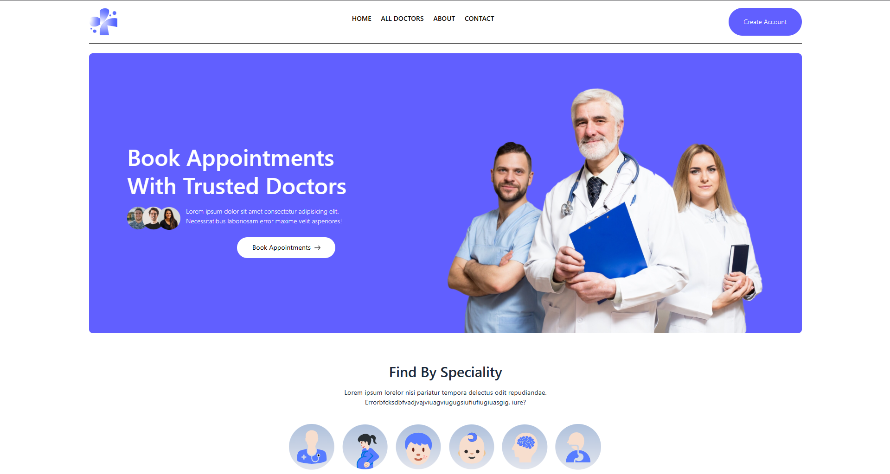 |
| **Secure Account Creation** | HIPAA-compliant patient registration with data encryption | 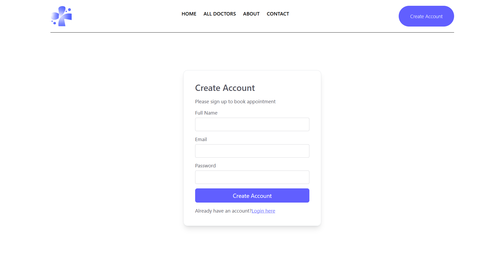 |
| **Intelligent Doctor Selection** | AI-powered matching with specialty filtering and availability | 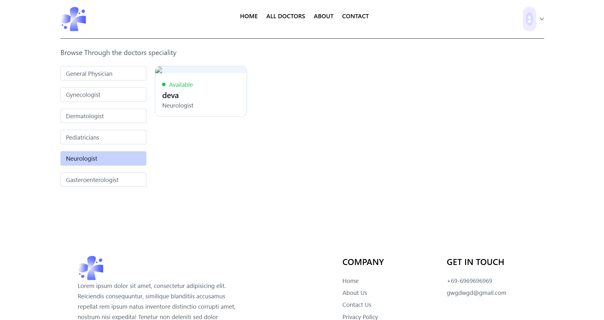 |
| **Smart Appointment Booking** | Real-time scheduling with automated confirmation and reminders | 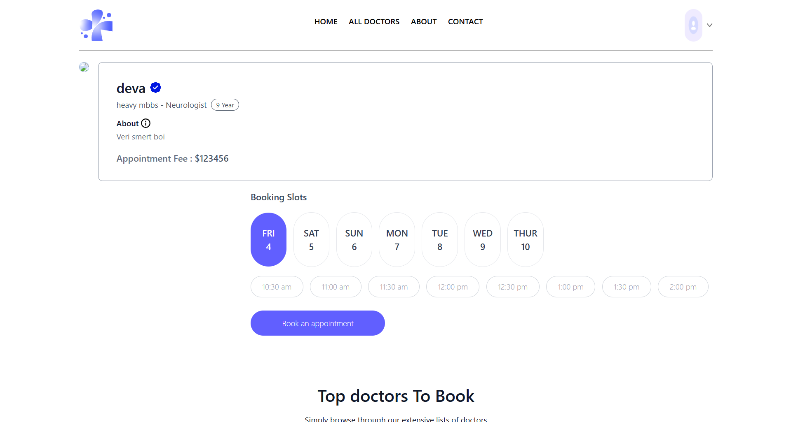 |
| **Interactive AI Assessment** | Comprehensive pre-consultation analysis with intelligent questioning | 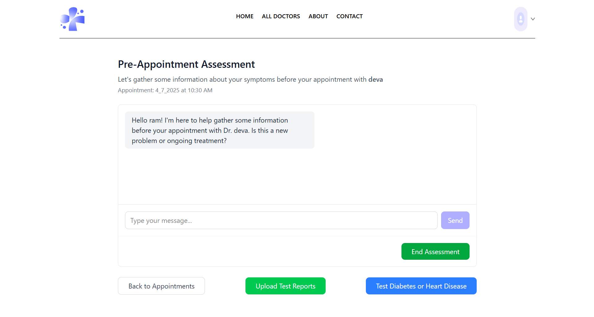 |
| **Appointment Management** | Complete history tracking with follow-up scheduling | 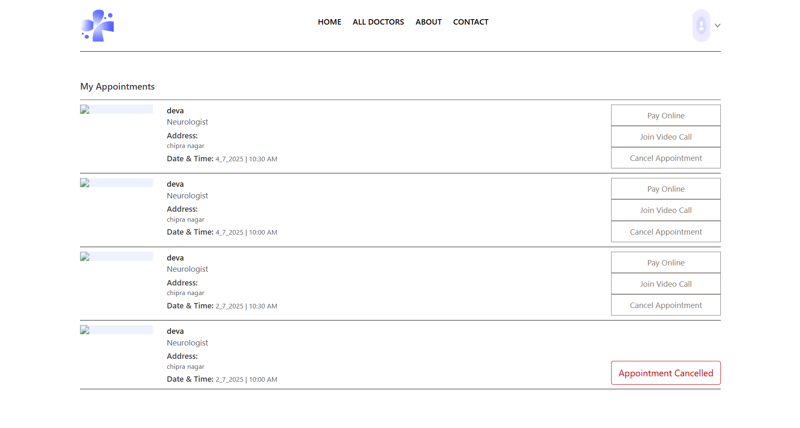 |
| **HD Video Consultation** | WebRTC-powered, secure video calls with recording capabilities |  |

### Healthcare Provider Dashboard

| Feature | Description | Screenshot |
|---------|-------------|------------|
| **Comprehensive Doctor Dashboard** | Real-time patient analytics and appointment management | 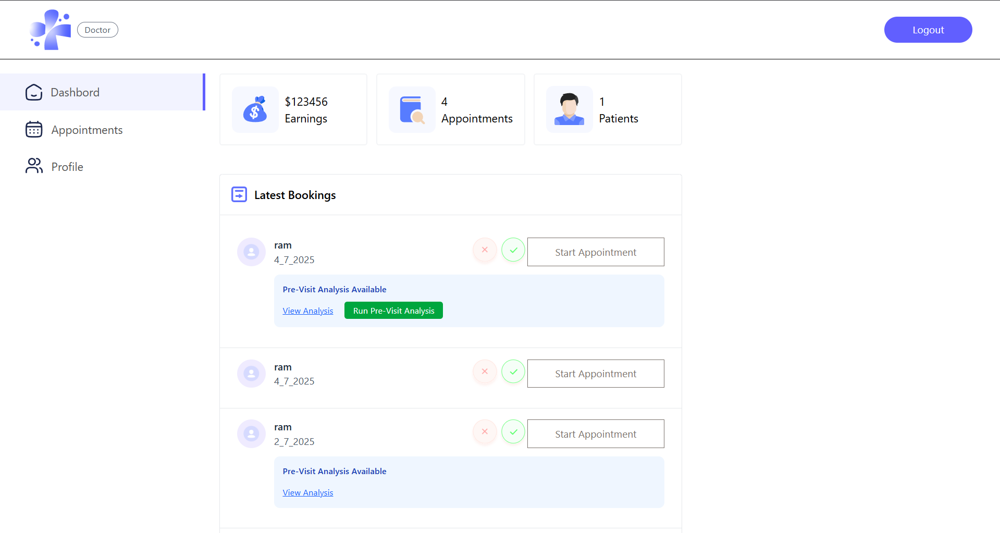 |
| **AI-Generated Pre-Visit Analysis** | Detailed patient insights and diagnostic suggestions | 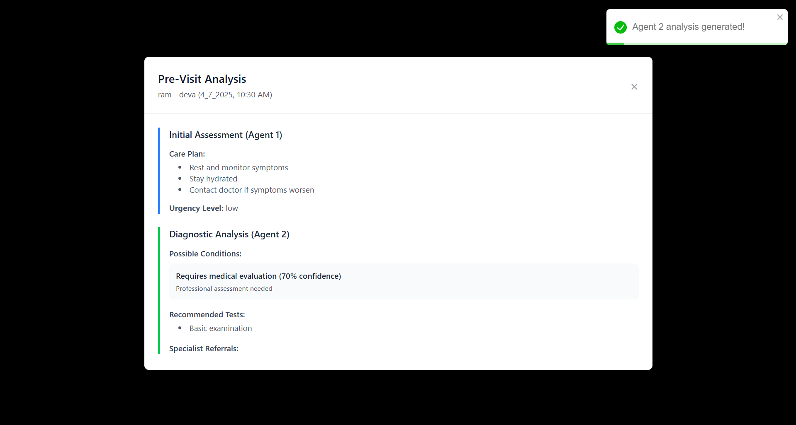 |
| **Appointment Management System** | Efficient scheduling and patient flow optimization | 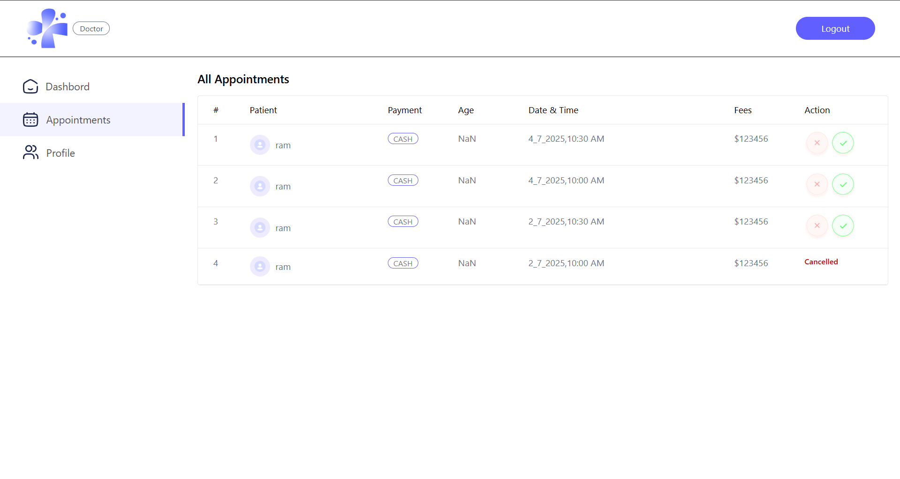 |

### Administrative Control Panel

| Feature | Description | Screenshot |
|---------|-------------|------------|
| **Advanced Admin Dashboard** | System oversight with comprehensive analytics and reporting |  |
| **Healthcare Provider Management** | Streamlined doctor onboarding and credential verification | 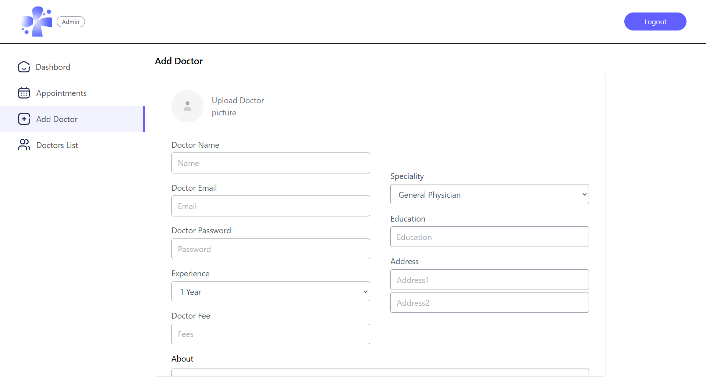 |

---

## User Journey & Workflow

### Patient Experience Flow

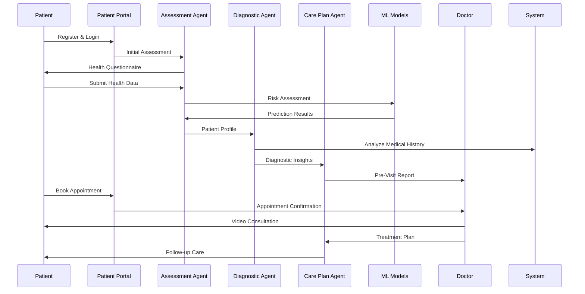

### Healthcare Provider Workflow

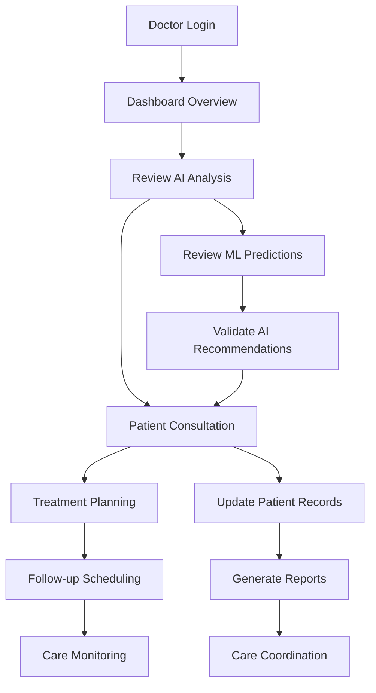

---

## System Architecture

### Microservices Architecture

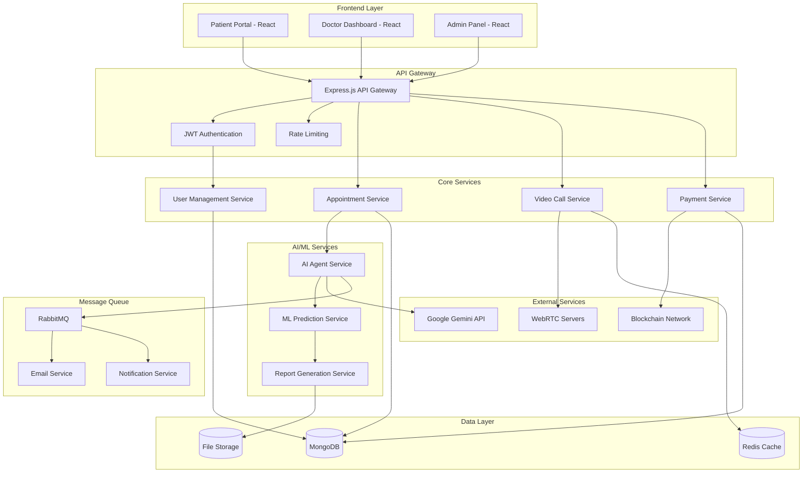

### Directory Structure

```
MediVerse/
├── frontend/                     # Patient-facing React.js Frontend
│   ├── public/                  # Static public assets
│   └── src/
│       ├── assets/             # Images, icons, styles
│       ├── components/         # Reusable components
│       ├── context/            # React context providers
│       ├── pages/              # Pages used in routing
│       └── service/            # Frontend services (e.g., API handlers)
├── admin/                        # Admin Panel (React.js)
│   ├── public/                 # Static assets
│   └── src/
│       ├── assets/             # Static assets for admin
│       ├── components/         # UI components used in admin views
│       ├── context/            # Context providers for admin
│       ├── pages/
│       │   ├── Admin/         # Admin-specific pages
│       │   └── Doctor/        # Doctor-specific pages within admin
│       └── service/            # API services for admin
├── backend/                      # Express + MongoDB Backend
│   ├── config/                 # Environment & database config
│   ├── controllers/           # API route handlers
│   ├── middlwares/            # Custom Express middleware
│   ├── models/                # Mongoose schemas
│   ├── routes/                # API route definitions
│   └── uploads/               # Uploaded files (e.g. reports)
├── disease_prediction_backend/  # ML Prediction Flask API
│   └── app/
│       ├── models/            # ML model files
│       │   └── dataset/       # Training datasets
│       └── routes/            # Flask API endpoints
├── screenshots/                 # Project screenshots for README/demo

```

---

## Installation & Setup

### Prerequisites

| Requirement | Version | Purpose |
|-------------|---------|---------|
| Node.js | ≥18.0.0 | JavaScript runtime |
| Python | ≥3.8.0 | AI/ML services |
| MongoDB | ≥6.0.0 | Database |

### Quick Start

### Run Docker 

```bash
# In root directory
docker-compose down
docker-compose up --build
```

### OR


**1. Clone and Setup**
```bash
# Clone the repository
git clone https://github.com/Annonnymmousss/MediVerse.git
cd MediVerse

# Install dependencies
npm run install:all
```

**2. Environment Configuration**
```bash
# Copy environment files
cp backend/.env.example backend/.env
cp frontend/.env.example frontend/.env

# Edit configuration files with your settings
# See Configuration section for details
```

**3. Database Setup**
```
# Start MongoDB
Add MongoDB url in the .env file of backend
```

**4. ML Services Setup**
```bash
# Setup Python environment
cd disease_predicton_backend
python -m venv venv
source venv/bin/activate  # On Windows: venv\Scripts\activate

# Install AI dependencies
pip install -r requirements.txt

# Configure Google Gemini API
export GEMINI_API_KEY=your_api_key_here
```

### Configuration

**Backend Environment Variables (.env)**
```

Follow .env.backup and make a .env file for yourself

```

**Frontend Environment Variables (.env)**
```


Follow .env.backup and make a .env file for yourself`
```

---

## Core Features Deep Dive

### 🤖 AI-Powered Healthcare Agents

**Intelligent Patient Assessment**
- Multi-stage health evaluation with adaptive questioning
- Symptom severity scoring and risk stratification
- Medical history analysis with pattern recognition
- Emergency case detection and immediate escalation

**Advanced Diagnostic Support**
- Differential diagnosis generation with confidence scoring
- Evidence-based treatment recommendations
- Drug interaction checking and allergy management
- Specialist referral optimization

### 📊 Machine Learning Analytics

**Predictive Healthcare Models**
- **Diabetes Risk Assessment**: 94.2% accuracy with early detection capabilities
- **Cardiovascular Risk Analysis**: 91.8% accuracy for heart disease prediction

**Clinical Decision Support**
- Real-time risk alerts and notifications
- Treatment effectiveness monitoring
- Population health analytics
- Quality improvement recommendations

### 🎥 Advanced Video Consultation

**HD Video Technology**
- WebRTC-powered, browser-based video calls
- Automatic quality adjustment based on connection
- Screen sharing for report review
- Session recording for medical records

**Consultation Features**
- Real-time vital signs monitoring (with compatible devices)
- Document sharing and collaborative annotation
- Prescription generation and e-signing
- Follow-up appointment scheduling
<!-- 
## API Documentation

### Authentication Endpoints

| Endpoint | Method | Description | Request Body |
|----------|--------|-------------|--------------|
| `/api/auth/register` | POST | User registration | `{ email, password, role, profile }` |
| `/api/auth/login` | POST | User login | `{ email, password }` |
| `/api/auth/logout` | POST | User logout | `{}` |
| `/api/auth/refresh` | POST | Refresh JWT token | `{ refreshToken }` |
| `/api/auth/forgot-password` | POST | Password reset request | `{ email }` |
| `/api/auth/reset-password` | POST | Password reset | `{ token, newPassword }` |

### Patient Management Endpoints

| Endpoint | Method | Description | Request Body |
|----------|--------|-------------|--------------|
| `/api/patients` | GET | Get patient list | Query params |
| `/api/patients/:id` | GET | Get patient details | None |
| `/api/patients/:id` | PUT | Update patient | `{ profile, medicalHistory }` |
| `/api/patients/:id/medical-history` | GET | Get medical history | None |
| `/api/patients/:id/medical-history` | POST | Add medical record | `{ record }` |

### Appointment Management Endpoints

| Endpoint | Method | Description | Request Body |
|----------|--------|-------------|--------------|
| `/api/appointments` | GET | Get appointments | Query params |
| `/api/appointments` | POST | Create appointment | `{ doctorId, patientId, datetime, type }` |
| `/api/appointments/:id` | GET | Get appointment details | None |
| `/api/appointments/:id` | PUT | Update appointment | `{ status, notes }` |
| `/api/appointments/:id/cancel` | POST | Cancel appointment | `{ reason }` |
| `/api/appointments/:id/reschedule` | POST | Reschedule appointment | `{ newDatetime }` |

### AI/ML Integration Endpoints

| Endpoint | Method | Description | Request Body |
|----------|--------|-------------|--------------|
| `/api/ai/assessment` | POST | Patient assessment | `{ symptoms, demographics, history }` |
| `/api/ai/diagnosis` | POST | Diagnostic analysis | `{ patientData, symptoms, tests }` |
| `/api/ai/care-plan` | POST | Care plan generation | `{ diagnosis, patientProfile, preferences }` |
| `/api/ml/predict/diabetes` | POST | Diabetes prediction | `{ age, bmi, glucose, bloodPressure }` |
| `/api/ml/predict/heart-disease` | POST | Heart disease prediction | `{ age, sex, chestPain, cholesterol, ecg }` | -->

<!-- ### WebSocket Events

```typescript
// Client to Server Events
interface ClientToServerEvents {
  'join-consultation': (appointmentId: string) => void;
  'leave-consultation': (appointmentId: string) => void;
  'video-offer': (offer: RTCSessionDescriptionInit) => void;
  'video-answer': (answer: RTCSessionDescriptionInit) => void;
  'ice-candidate': (candidate: RTCIceCandidate) => void;
  'chat-message': (message: string) => void;
}

// Server to Client Events
interface ServerToClientEvents {
  'consultation-joined': (participants: string[]) => void;
  'consultation-left': (participantId: string) => void;
  'video-offer': (offer: RTCSessionDescriptionInit) => void;
  'video-answer': (answer: RTCSessionDescriptionInit) => void;
  'ice-candidate': (candidate: RTCIceCandidate) => void;
  'chat-message': (message: { sender: string; content: string; timestamp: Date }) => void;
  'ai-analysis-update': (analysis: AIAnalysis) => void;
}
```

--- -->

### HIPAA Compliance Features

**Administrative Safeguards**
- Security Officer appointment and responsibilities
- Workforce training and access management
- Information access management procedures
- Security awareness and training programs
- Incident response and reporting procedures

**Physical Safeguards**
- Facility access controls and restrictions
- Workstation use and access controls
- Device and media controls
- Secure disposal of electronic media

**Technical Safeguards**
- Access control and unique user identification
- Automatic logoff and encryption
- Audit controls and integrity monitoring
- Person or entity authentication


## Troubleshooting

### Common Issues

1. **Import Errors**: Ensure all dependencies are installed
2. **File Not Found**: Check dataset file paths
3. **Memory Issues**: Large datasets may require more RAM
4. **Port Already in Use**: Change port in main.py or kill existing process

### Logs

Check console output for detailed error messages and request logs.

## Contributing

1. Fork the repository
2. Create feature branch
3. Make changes
4. Add tests
5. Submit pull request

## License

This project is licensed under the MIT License.

## Support

For issues and questions:
- Check the troubleshooting section
- Review error logs
- Open an issue in the repository

